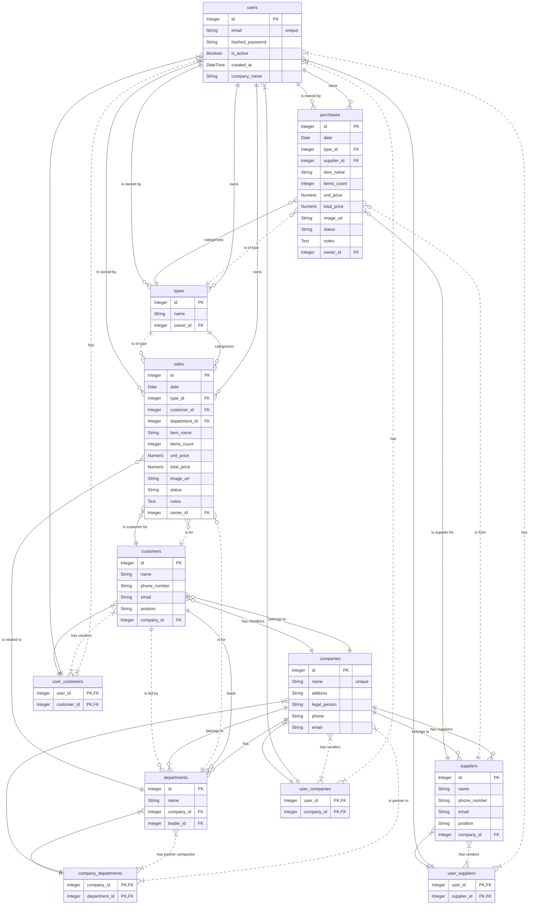

# Entity Relationship Diagram

```mermaid
erDiagram
    users {
        Integer id PK
        String email "unique"
        String hashed_password
        Boolean is_active
        DateTime created_at
        String company_name
    }

    companies {
        Integer id PK
        String name "unique"
        String address
        String legal_person
        String phone
        String email
    }

    customers {
        Integer id PK
        String name
        String phone_number
        String email
        String position
        Integer company_id FK
    }

    suppliers {
        Integer id PK
        String name
        String phone_number
        String email
        String position
        Integer company_id FK
    }

    departments {
        Integer id PK
        String name
        Integer company_id FK
        Integer leader_id FK
    }

    purchases {
        Integer id PK
        Date date
        Integer type_id FK
        Integer supplier_id FK
        String item_name
        Integer items_count
        Numeric unit_price
        Numeric total_price
        String image_url
        String status
        Text notes
        Integer owner_id FK
    }

    sales {
        Integer id PK
        Date date
        Integer type_id FK
        Integer customer_id FK
        Integer department_id FK
        String item_name
        Integer items_count
        Numeric unit_price
        Numeric total_price
        String image_url
        String status
        Text notes
        Integer owner_id FK
    }

    types {
        Integer id PK
        String name
        Integer owner_id FK
    }

    user_companies {
        Integer user_id PK, FK
        Integer company_id PK, FK
    }

    user_customers {
        Integer user_id PK, FK
        Integer customer_id PK, FK
    }

    user_suppliers {
        Integer user_id PK, FK
        Integer supplier_id PK, FK
    }

    company_departments {
        Integer company_id PK, FK
        Integer department_id PK, FK
    }

    users ||--o{ purchases : "owns"
    users ||--o{ sales : "owns"
    users ||--o{ types : "owns"
    users }|..|{ user_companies : "has"
    users }|..|{ user_customers : "has"
    users }|..|{ user_suppliers : "has"

    companies ||--o{ departments : "has"
    companies ||--o{ customers : "has members"
    companies ||--o{ suppliers : "has suppliers"
    companies }|..|{ user_companies : "has vendors"
    companies }|..|{ company_departments : "is partner in"

    customers }o--|| companies : "belongs to"
    customers ||--o{ sales : "is customer for"
    customers ||--o{ departments : "leads"
    customers }|..|{ user_customers : "has vendors"

    suppliers }o--|| companies : "belongs to"
    suppliers ||--o{ purchases : "is supplier for"
    suppliers }|..|{ user_suppliers : "has vendors"

    departments }o--|| companies : "belongs to"
    departments }o..|| customers : "is led by"
    departments ||--o{ sales : "is related to"
    departments }|..|{ company_departments : "has partner companies"

    purchases }o..|| types : "is of type"
    purchases }o..|| suppliers : "is from"
    purchases }o--|| users : "is owned by"

    sales }o..|| types : "is of type"
    sales }o..|| customers : "is for"
    sales }o..|| departments : "is for"
    sales }o--|| users : "is owned by"

    types ||--o{ purchases : "categorizes"
    types ||--o{ sales : "categorizes"
    types }o--|| users : "is owned by"

    user_companies ||--|{ users : ""
    user_companies ||--|{ companies : ""
    user_customers ||--|{ users : ""
    user_customers ||--|{ customers : ""
    user_suppliers ||--|{ users : ""
    user_suppliers ||--|{ suppliers : ""
    company_departments ||--|{ companies : ""
    company_departments ||--|{ departments : ""
```
